# README.md

## 1. Hệ thống giải quyết vấn đề gì

Hệ thống được thiết kế theo mô hình **Microservices**, giải quyết các vấn đề trong quản lý bán hàng trực tuyến, bao gồm:

* Quản lý người dùng (đăng ký, đăng nhập, xác thực JWT).
* Quản lý sản phẩm (thêm, xem, mua hàng).
* Quản lý đơn hàng (xử lý bất đồng bộ thông qua RabbitMQ).
* Đảm bảo khả năng mở rộng, dễ bảo trì và tách biệt chức năng.
---

## 2. Các dịch vụ trong hệ thống

Dự án bao gồm 6 dịch vụ chính (được định nghĩa trong `docker-compose.yml`):

| Dịch vụ         | Chức năng                                         | Port  |
| --------------- | ------------------------------------------------- | ----- |
| **api-gateway** | Cổng vào chính, điều phối request tới các service | 3003  |
| **auth**        | Quản lý xác thực, JWT, và thông tin người dùng    | 3000  |
| **product**     | Quản lý sản phẩm, gửi thông tin đặt hàng          | 3001  |
| **order**       | Tiếp nhận và xử lý đơn hàng từ RabbitMQ           | 3002  |
| **mongo**       | Cơ sở dữ liệu MongoDB                             | 27017 |
| **rabbitmq**    | Hàng đợi message, kết nối các service             | 5672  |

---

## 3. Ý nghĩa từng dịch vụ

### **API Gateway**

* Là cầu nối giữa client và các service nội bộ.
* Định tuyến request theo URL.
* Giúp tập trung xử lý bảo mật và logging.

### **Auth Service**

* Cung cấp API đăng ký, đăng nhập, xác thực JWT.
* Lưu thông tin người dùng trong MongoDB.

### **Product Service**

* Cung cấp API để thêm, xem danh sách sản phẩm, và mua hàng.
* Khi người dùng mua hàng, service sẽ gửi message vào RabbitMQ.

### **Order Service**

* Nhận message từ RabbitMQ, lưu đơn hàng vào MongoDB.
* Đảm bảo quy trình xử lý đơn hàng diễn ra độc lập và ổn định.


---

## 4. Các mẫu thiết kế được sử dụng

* **Microservices Architecture:** Mỗi chức năng là một service riêng biệt.
* **API Gateway Pattern:** Làm nhiệm vụ định tuyến và kiểm soát truy cập.
* **MVC Pattern:** Tách lớp controller, service, repository trong từng service.
* **Repository Pattern:** Truy cập dữ liệu tập trung qua repository.
* **Event-driven Architecture:** Giao tiếp bất đồng bộ thông qua RabbitMQ.
* **JWT Authentication:** Xác thực người dùng bằng token.
* **Docker Compose:** Dựng môi trường phát triển toàn bộ hệ thống.

---
## 5.Luồng giao tiếp giữa các dịch vụ
| Thành phần                 | Giao tiếp chính | Phương thức         | Mục đích |
|-----------------------------|-----------------|---------------------|----------|
| Client ↔ API Gateway        | HTTP REST       | Gửi và nhận yêu cầu giữa frontend và hệ thống | Trao đổi dữ liệu trực tiếp |
| API Gateway ↔ Services      | HTTP nội bộ     | Gọi API giữa các container nội bộ (qua Docker network) | Phân phối yêu cầu đến đúng microservice |
| Services ↔ RabbitMQ         | Message Queue   | Gửi/nhận message bất đồng bộ | Xử lý tác vụ nền hoặc đồng bộ dữ liệu giữa các service |
| Auth ↔ Các service khác     | JWT Token       | Gửi token qua Header | Xác thực và phân quyền người dùng |
| Mỗi Service ↔ Database      | Kết nối riêng   | Thông qua ORM hoặc driver DB | Lưu trữ và truy xuất dữ liệu cục bộ |

## 66. Hướng dẫn chạy hệ thống

1. **Khởi chạy hệ thống:**

```bash
docker-compose up --build
```
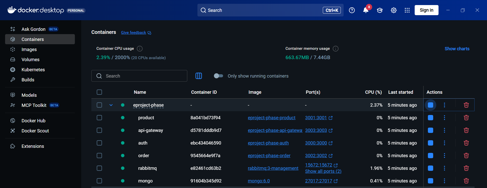

22. **Truy cập API Gateway:**

### 🔹 **Auth Service**

**Đăng ký người dùng:**

```bash
POST http://localhost:3003/auth/register
{
  "username": "user1",
  "password": "123456"
}
```
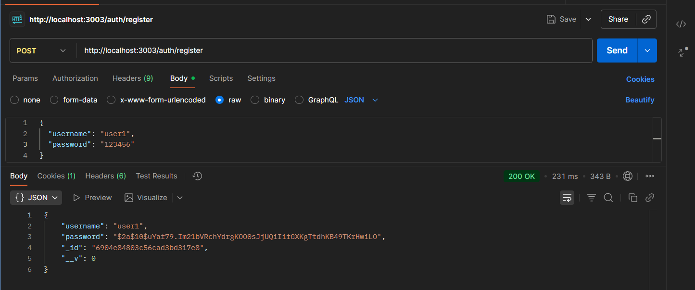
**Đăng nhập:**

```bash
POST  http://localhost:3003/auth/login
{
  "username": "user1",
  "password": "123456"
}
```

Kết quả trả về JWT token dùng cho các service khác.

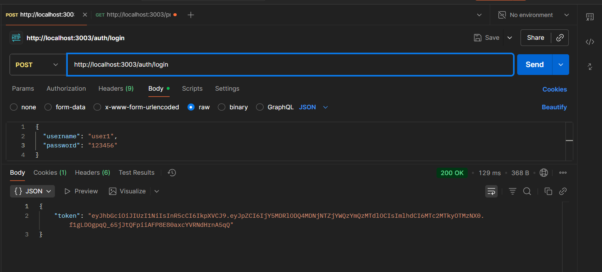

---

### 🔹 **Product Service**

**Thêm sản phẩm mới:**

Xác thực người dùng bằng mã token trước khi thực hiện các thao tác trong product vì cần đi qua middleware xác thực mới được truy cập vào dữ liệu

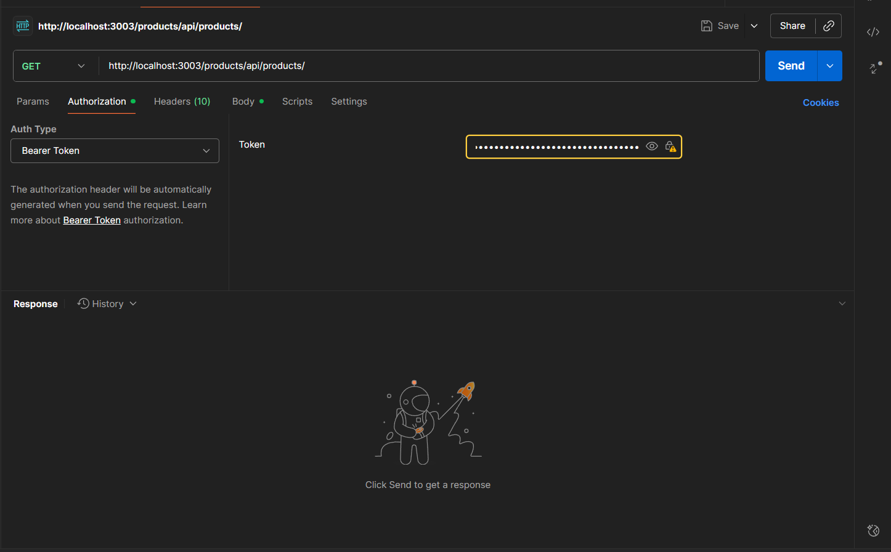

**Tạo sản phẩm mới:**
```bash
POST  http://localhost:3003/products/api/products
Authorization: Bearer <JWT_TOKEN>
{
  "name": "Iphone 15",
  "price": 200,
  "description": "black, 256gb"
}
```
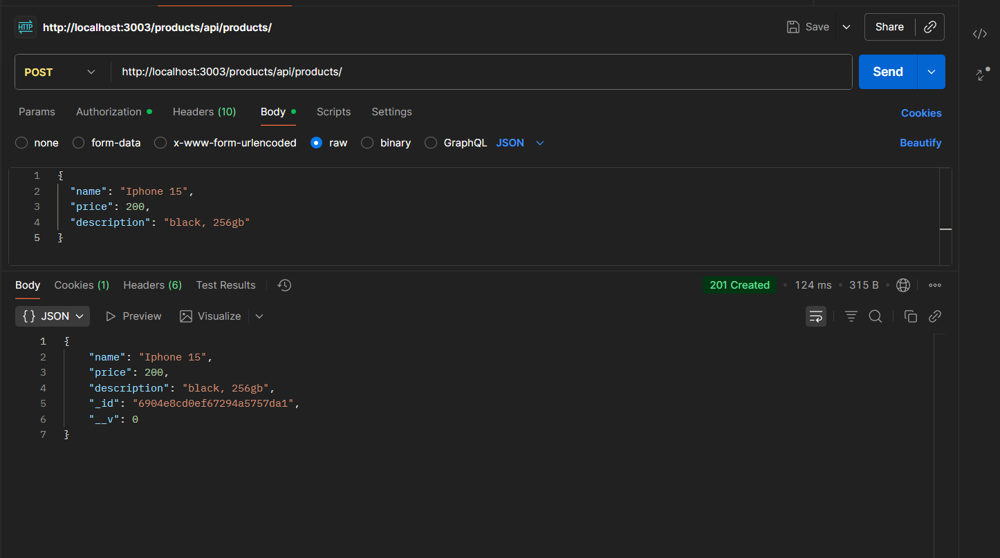
**Xem danh sách sản phẩm:**

```bash
GET  http://localhost:3003/products/api/products
```
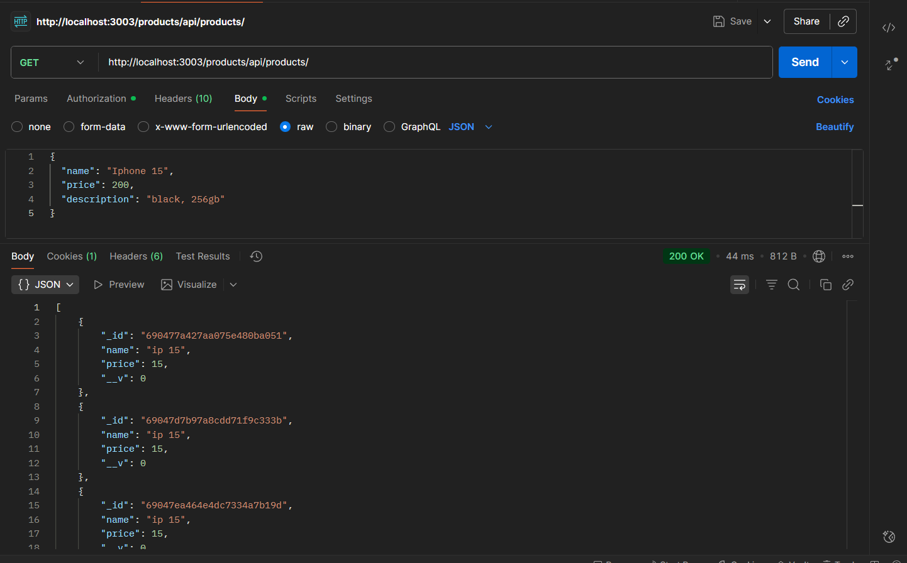

---

**Lấy sản phẩm bằng id:**

```bash
POST /products/api/products/
Authorization: Bearer <JWT_TOKEN>
{
  "productId": "<id_sản_phẩm>",
  "quantity": 1
}
```

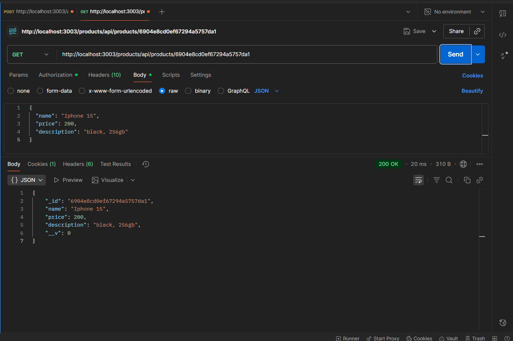

---

**Mua hàng:**

```bash
POST /products/api/products/buy
Authorization: Bearer <JWT_TOKEN>
{
  "ids": ["6904e8cd0ef67294a5757da1"]
}
```

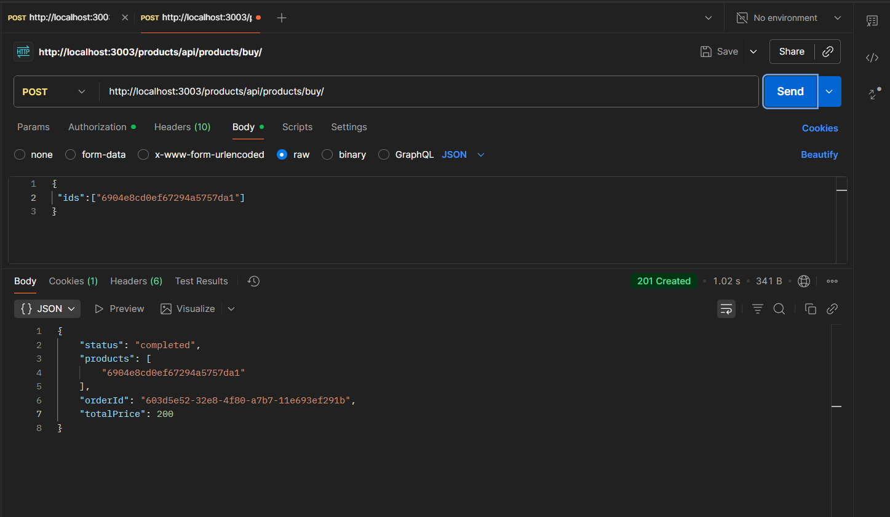


---


33. **Kiểm tra RabbitMQ Dashboard:**

```
http://localhost:15672 (user: admin / pass: 123456)
```

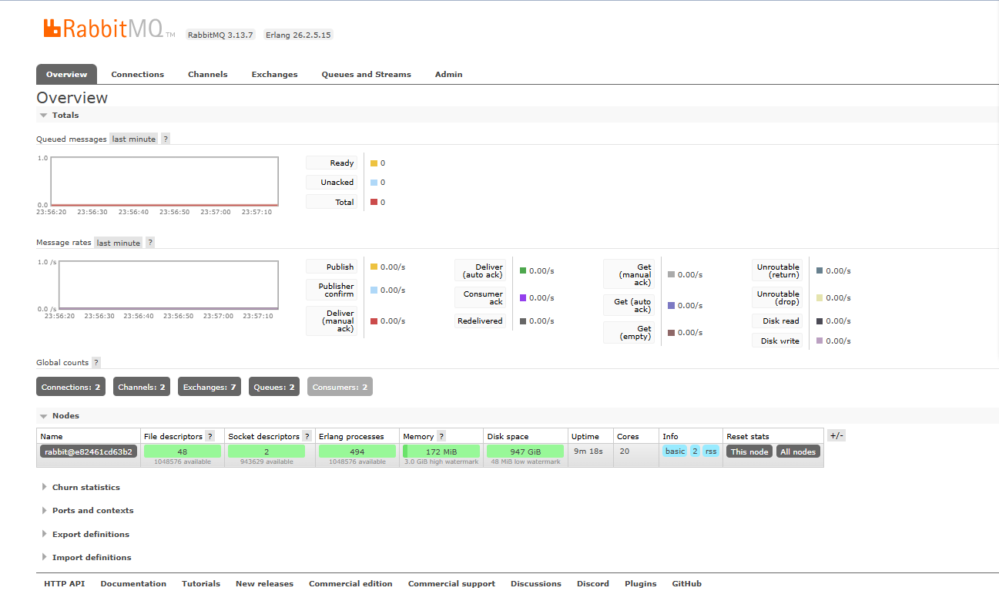

---
Hàng đợi của các hóa đơn 

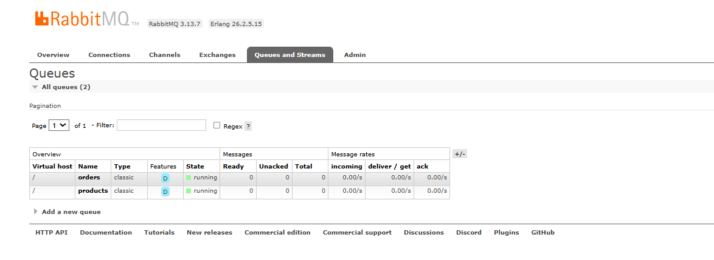

---

## 7. CI/CD kiểm thử và push lên dockerhub
CI: Kiểm thử, test các chức năng của code trước khi tạo image trên dockerhub
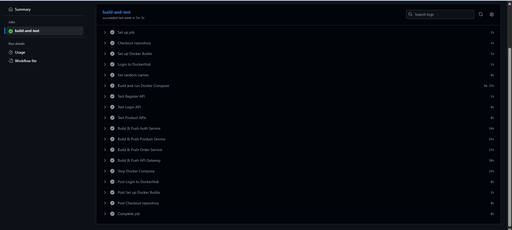
CD: Sau thi test xong hệ thống thì tạo các server trong dockerhub
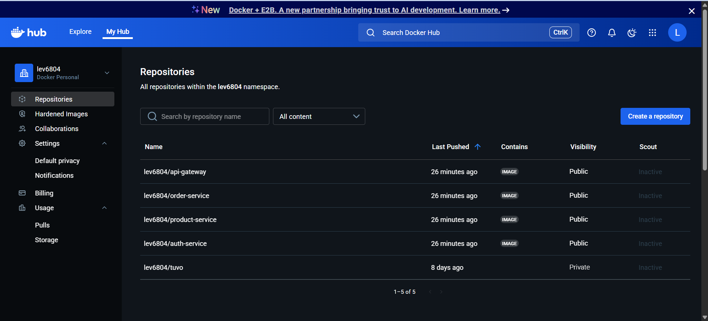

## 8. Kết luận

Hệ thống minh họa cho kiến trúc **Microservices** gồm các service Auth – Product – Order được điều phối qua **API Gateway**, giao tiếp bằng **RabbitMQ**, và quản lý bởi **Docker Compose**. Cấu trúc này đảm bảo tính mở rộng, linh hoạt và dễ bảo trì cho ứng dụng thương mại điện tử.
